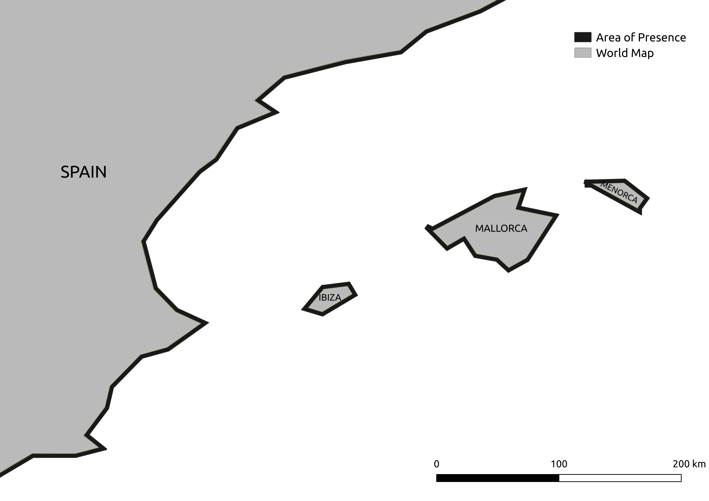
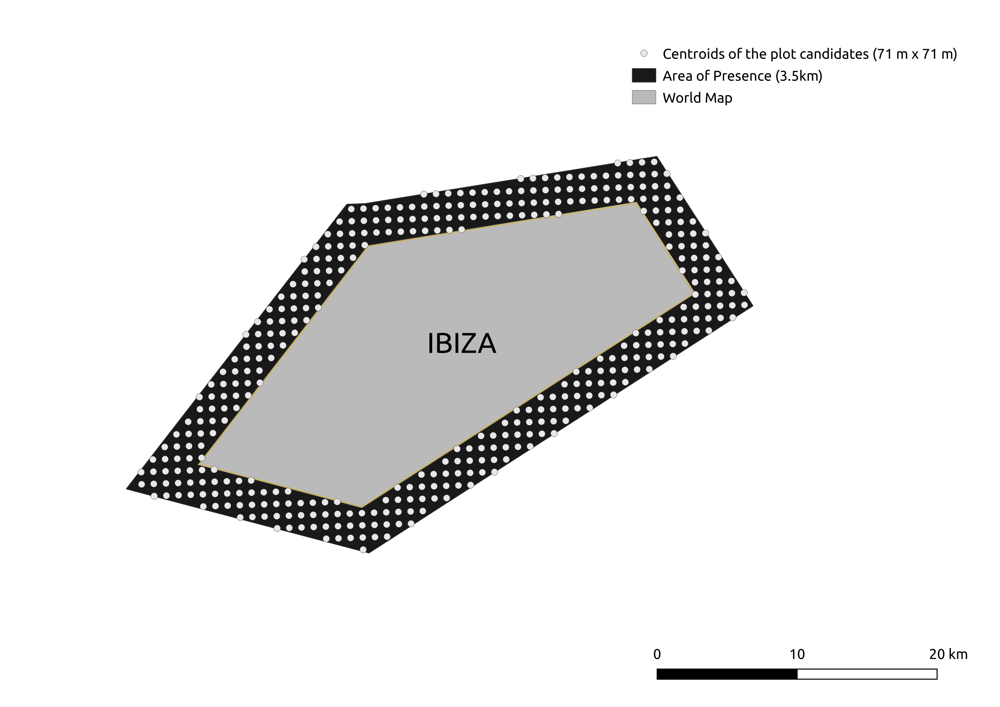
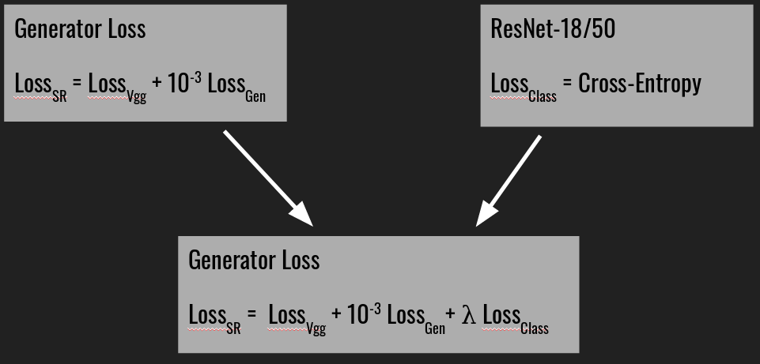

# SOCIS_2019
This project lies on the complexity of detecting whales in satelite images. In particular, only the Mediterranean Sea is considered. 

## Steps
* Image gathering from the first 3km margin from the coast into the ocean coming from Google Maps and Bing Maps. The former uses the GCP framework and the static maps API. Then with the unique key assigned for the use of the API many requests can be made with the exact bounding box coordinates (latitud and longitude of the top left corner and bottom right corner) to extract the image. The latter uses the code in [this repository](https://github.com/manurare/Satellite-Aerial-Image-Retrieval.git) to read a .csv file where each line indicates the coordinates of a particular bounding box to get the current image.

  
   

* Due to the lack of spatial resolution in satellite images a superresolution step is required to increased high frequencies and restore fine details. SRGAN and Pixel Recursive Super Resolution were tested. This step will ease the performance of different object detection algorithms.
* Implement a new loss on the generator to generate not only SR images but images belonging to specific classes in which inherent features are enhanced to ease the classification task.

  

* Check via image classification whether the modified generator was succesfull into reducing false positives. 

## Results
In this [link](https://www-iuem.univ-brest.fr/datacube/sample-apps/rshiny_app/) you can check an interactive map where different raster data layers can be uploaded (rds files) and modified to be overlapped, combined and weighted among them with higher and lower intensity to evaluate visually different aspects from satellite data. **Test rds files can be found in SOCIS_2019/rshiny_app/rds_files**

