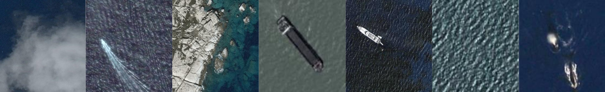
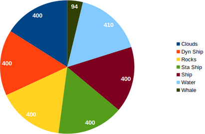
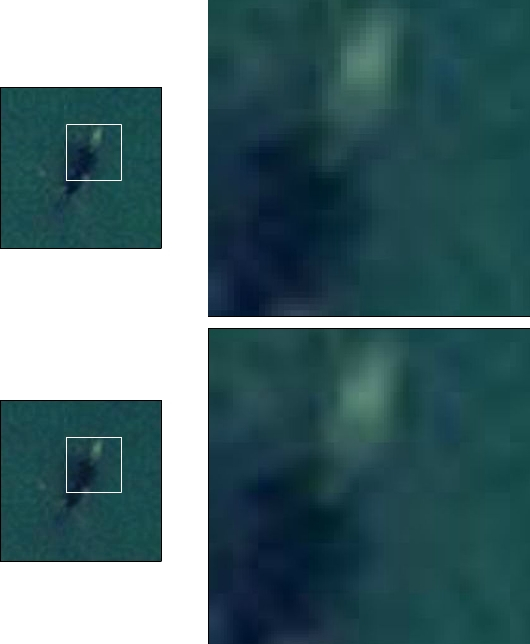

# SOCIS_2019
This project lies on the complexity of detecting whales in satelite images. In particular, only the Mediterranean Sea is considered. 

## Dataset 
In this project we have used two datasets: a **satellite image dataset** with low-resolution images acquired from Google and Bing Maps and labelled by ourselves, and a **super-resolution (SR) dataset** to train the SRGAN to learn a correct mapping from low-resolution (LR) to high-resolution (HR) images. 

The satellite dataset consists on seven classes: clouds, dynamic ship, rocks, static ship, ship, water and whale. The dataset is unbalanced since whales is a species in danger of extinction and there are not many specimens. What is even harder is finding them on the ocean surface. 

  

  

The SR dataset consists of high resolution with high frequency information. This is key when training super resolution models as they need to downsample the HR image to get the LR and then learn the mapping to recover high frequencies. This training is not possible with satellite images as there is not high frequency information on them.

## Steps
* Image gathering from the first 3.5km margin offshore. Subsequently the area is sampled in 71x71m plots (double of a regular blue whale of 30m). The plot coordinates is then requested to Google Maps and Bing Maps. The former uses the GCP framework and the static maps API. Then with the unique key assigned for the use of the API up to 150000 requests can be made to extract the plot images. The latter uses the code in [this repository](https://github.com/manurare/Satellite-Aerial-Image-Retrieval.git) to read a .csv file where each line indicates the coordinates of a particular plot.

  
  

* Due to the lack of spatial resolution in satellite images a superresolution step is required to increased high frequencies and restore fine details. SRGAN and Pixel Recursive Super Resolution were tested. We verified that the best approach was to use SRGAN. The latter is an old architecture and does not take on account precisely the global image information. Furthermore, it takes more than 100h per image when predicting resulting in unacceptable computational time comsuption. SRGAN on the other hand, has fast prediction times (15fps) and the resulting super-resolved image is sharper and objectively better than with PRSR.

* Implement a new loss on the generator to generate not only SR images but images belonging to specific classes in which inherent features are enhanced to ease the classification task.

  

* Check via image classification whether the modified generator was succesfull into reducing false positives. 

## Results
In this [link](https://www-iuem.univ-brest.fr/datacube/sample-apps/rshiny_app/) you can check an interactive map where different raster data layers can be uploaded (rds files) and modified to be overlapped, combined and weighted among them with higher and lower intensity to evaluate visually different aspects from satellite data. **Test rds files can be found in SOCIS_2019/rshiny_app/rds_files**

### Metric Results for ResNet-18
|Dataset|Accuracy|Whale Score|
| --- | --- | --- |
| Original SD | **0.946** | **149.163** |
| Bicubic x2 | 0.938 | 83.974 |
| SRGAN x2 | 0.932 | 107.034 |
| SRGAN x2 + ResNet-18, &#955;=2 | 0.932 | 100.715 |
| SRGAN x2 + ResNet-18, &#955;=1 | 0.924 | 125.493 |
| SRGAN x2 + ResNet-18, &#955;=0.1 | 0.918 | 119.689 |
| SRGAN x2 + ResNet-18, &#955;=0.01 | 0.922 | 103.630 |
| SRGAN x2 + ResNet-18, &#955;=0.001 | 0.920 | 116.397 |

### Metric Results for ResNet-50
|Dataset|Accuracy|Whale Score|
| --- | --- | --- |
| Original SD | 0.886 | 92.016 |
| Bicubic x2 | 0.890 | 79.944 |
| SRGAN x2 | **0.900** | **121.293** |
| SRGAN x2 + ResNet-50, &#955;=2 | 0.864 | 62.844 |
| SRGAN x2 + ResNet-50, &#955;=1 | 0.868 | 86.003 |
| SRGAN x2 + ResNet-50, &#955;=0.1 | 0.852 | 71.302 |
| SRGAN x2 + ResNet-50, &#955;=0.01 | 0.798 | 53.280 |
| SRGAN x2 + ResNet-50, &#955;=0.001 | **0.874** | **148.354** |

### Visual result Super-resolution 
On the top image it is depicted the raw satellite dataset while in the bottom one the step of resolution is considered.

  

